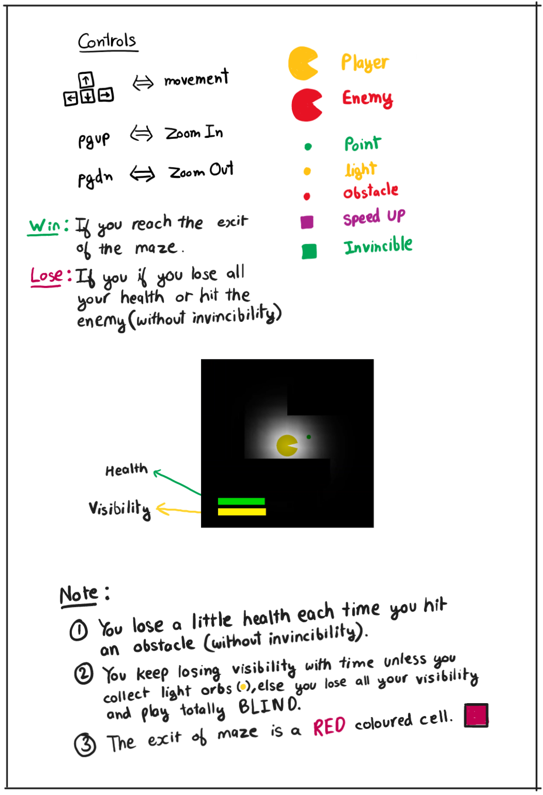

# Packman-In-The-Dark
 A modified version of the classic Pacman game where packman needs to exit a dark maze with only a limited visibilty that diminishes with time.

# Build Instructions
 - Setup OpenGL, GLEW, and FreeGLUT in Visual Studios as per the instructions at https://openglbook.com/blog/setting-up-opengl-glew-and-freeglut-in-visual-c/.
 - Run the repository as Visual Studios Project.

<video src="[https://user-images.githubusercontent.com/126239/151127893-5c98ba8d-c431-4a25-bb1f-e0b33645a2b6.mp4](https://github.com/saranshdave98/Packman-In-The-Dark/blob/main/Packman%20in%20the%20dark.gif?raw=true)"></video>
